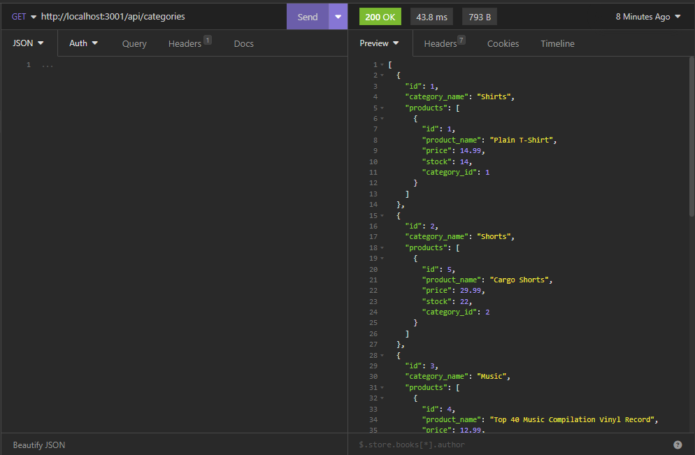
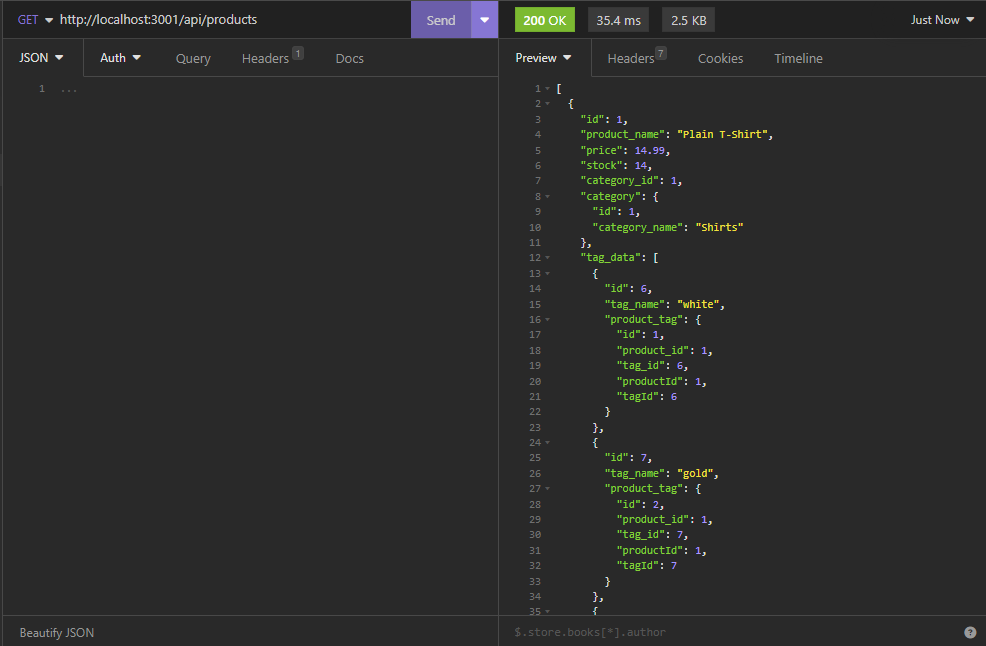
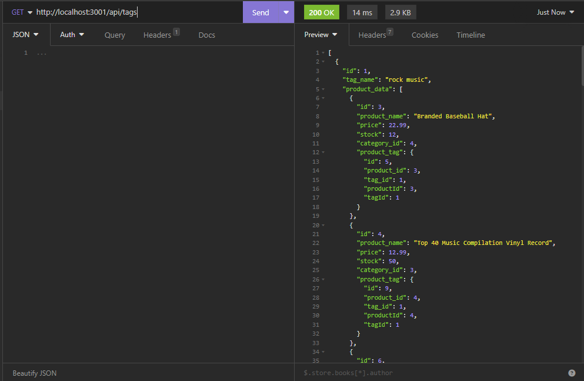
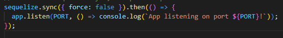
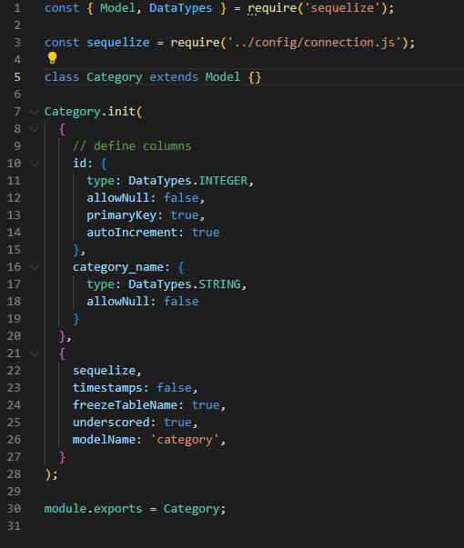
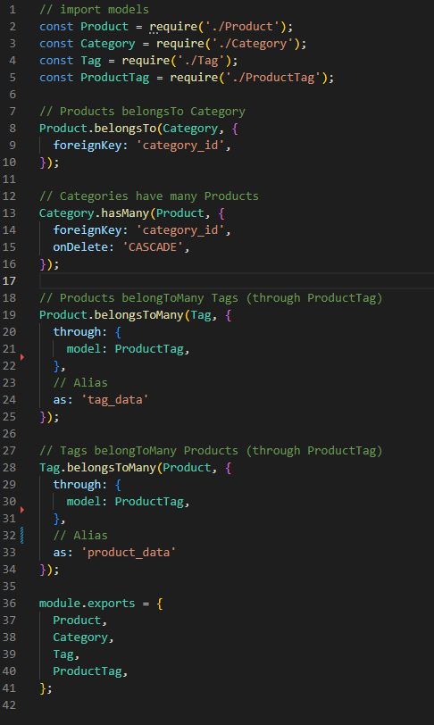
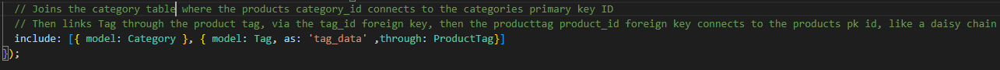

# Challenge-11-E-Commerece-Back-End
Built a back end for an e-commerce site using starter code. Configuring with a working express.js api, and using sequelize to interact with the mysql database

## Video Demonstration


## How to Run

* Make sure to create an .env file that matches the .env.Example file, with credentials added.

* Create the database by running mysql in the db folder and the running the command 

    * SOURCE schema.sql

* After that, run the command

    * npm run seed

* Once that is done, run

    * node server.js

* The application will go live in http://localhost:3001

* These are the links for each model. Paste them into insomnia.

    * http://localhost:3001/api/categories/

    * http://localhost:3001/api/products/

    * http://localhost:3001/api/tags/

* Add the desired id number at the end of the link!

## POST and PUT JSON bodies


Category POST and PUT


```md
{
  "category_name": "ENTER NAME OF CATEGORY HERE",
} 
```

Product POST and PUT


```md
{
  "product_name": "STRING NAME",
  "price": DECIMAL(10,2),
  "stock": INTEGER,
	"category_id": INTEGER,
  "tagIds": [ ARRAY OF INTEGERS ]
} 
```

Tag POST and PUT

```md
{
  "tag_name": "ENTER NAME OF TAG HERE",
} 
```

## Insomnia Screenshots

http://localhost:3001/api/categories/



http://localhost:3001/api/products/



http://localhost:3001/api/tags/



## Code Breakdown

First thing needed was to create the sequalized server code. By replacing the old code of

```md
app.listen(PORT, () => {
  console.log(`App listening on port ${PORT}!`);
});
```
with the updated code of:



After the server had been updated with the proper code to get sequelize running.

the next part of the code tackled was the models. Starting off with the category model. 

Most of it was just following what the readme has said to name each column in the category table, same would go for the other 3 tables, making sure they fit the criteria, for what the database models should look like.



Next was to create the relationships between the models in the index.js.

Once again just following with what the comments left behind in the started code were asking of me.

The important part here is where the aliasas come into play.
The alias is suppose to match the alias in the routes folder. second pic will show what I mean.



This is when the joins are created when the get request is created for the id and its associated data



Alot of the code in the routes folder is filled with comments, these are just some of the more important parts of the code that needed a greater explanation as a whole.

## User Story

```md
AS A manager at an internet retail company
I WANT a back end for my e-commerce website that uses the latest technologies
SO THAT my company can compete with other e-commerce companies
```

## Acceptance Criteria

```md
GIVEN a functional Express.js API
WHEN I add my database name, MySQL username, and MySQL password to an environment variable file
THEN I am able to connect to a database using Sequelize
WHEN I enter schema and seed commands
THEN a development database is created and is seeded with test data
WHEN I enter the command to invoke the application
THEN my server is started and the Sequelize models are synced to the MySQL database
WHEN I open API GET routes in Insomnia for categories, products, or tags
THEN the data for each of these routes is displayed in a formatted JSON
WHEN I test API POST, PUT, and DELETE routes in Insomnia
THEN I am able to successfully create, update, and delete data in my database
```
